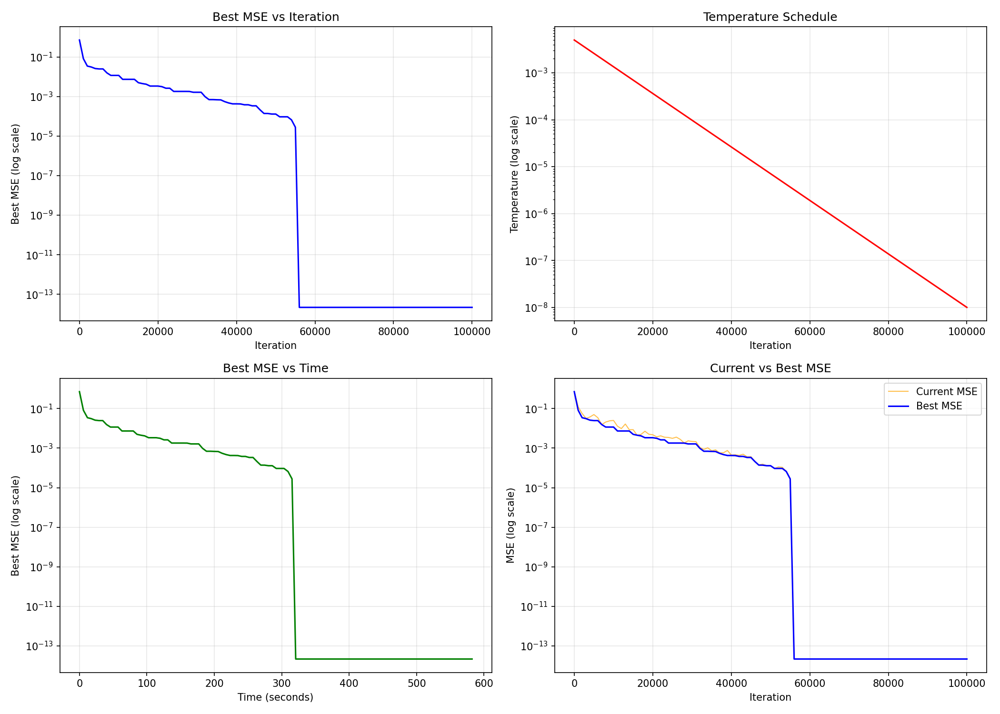

# Neural Network Reconstruction Puzzle - Solution

## Problem Statement

The original problem is here: https://huggingface.co/spaces/jane-street/droppedaneuralnet

A neural network "fell apart" into 97 individual linear layer pieces. The task is to reconstruct the original network by finding the correct permutation of these pieces.

The network architecture consists of:
- **48 Blocks**: Each Block has a residual connection with an `inp` layer (Linear 48→96), ReLU activation, and `out` layer (Linear 96→48)
- **1 LastLayer**: A final linear layer (Linear 48→1) for output

```python
class Block(nn.Module):
    def forward(self, x):
        residual = x
        x = self.inp(x)      # Linear(48, 96)
        x = self.activation(x)  # ReLU
        x = self.out(x)      # Linear(96, 48)
        return residual + x
```

## Solution Approach

### Part 1: Identify the LastLayer

The LastLayer is trivially identified by its unique weight shape `(1, 48)` - only **piece_85** has this shape.

| Shape | Count | Layer Type |
|-------|-------|------------|
| (96, 48) | 48 | `inp` layers (Linear 48→96) |
| (48, 96) | 48 | `out` layers (Linear 96→48) |
| (1, 48) | 1 | LastLayer (piece_85) |

### Part 2: Pair inp and out Layers into Blocks

Each Block's `inp` and `out` layers should have related weights because they process the same hidden neurons. We use average absolute cosine similarity across neurons to match them.

#### Why this metric works

For each hidden neuron `i`:
- `inp` layer row `i` (shape 48): weights determining how 48 input features combine to activate neuron `i`
- `out` layer column `i` (shape 48): weights determining how neuron `i`'s activation affects the 48 outputs

**Why matched pairs have high similarity:** During backpropagation, both the input weights and output weights of a Block are shaped by coupled gradients.

**Why non-matching pairs have low similarity:** The residual connections decorrelate gradients between blocks. Pairing an `inp` layer from Block A with an `out` layer from Block B therefore compares neurons whose gradients were uncorrelated during training - their weight vectors are essentially random with respect to each other, giving the expected value for random unit vectors in R^48.

#### Results


**Key findings:**
- **Best match similarity**: mean=0.321, range=[0.275, 0.415]
- **Non-match similarity**: mean=0.116, std=0.009
- **Expected random (R^48)**: 0.115

The non-match similarity (0.116) is nearly identical to the expected value for random vectors in R^48 (0.115), confirming that non-matching layers are uncorrelated.

Each input layer has exactly one clear outlier match among the 48 output layers, making pairing unambiguous.

### Part 3: Find Block Ordering with Simulated Annealing

With inp/out pairs identified, we have 48 Blocks to order. We use simulated annealing with:
- **Objective**: MSE between model output and historical predictions
- **Neighbor function**: Swap two random blocks
- **Temperature schedule**: Geometric cooling from T_start=0.005 to T_end=1e-8

#### Results



| Iteration | Best MSE | Temperature | Time |
|-----------|----------|-------------|------|
| 0 | 7.12e-01 | 5.00e-03 | 0.0s |
| 10,000 | 1.16e-02 | 1.35e-03 | 57.2s |
| 20,000 | 3.35e-03 | 3.62e-04 | 113.9s |
| 30,000 | 1.63e-03 | 9.75e-05 | 171.2s |
| 40,000 | 4.23e-04 | 2.63e-05 | 229.2s |
| 50,000 | 1.29e-04 | 7.07e-06 | 286.1s |
| **56,000** | **2.18e-14** | 3.22e-06 | **320.8s** |

The algorithm found the perfect solution (MSE ≈ 0) at iteration 56,000 after ~5.3 minutes.

## Final Solution

The solution is a permutation of 97 piece indices representing:
```
[inp_0, out_0, inp_1, out_1, ..., inp_47, out_47, last_layer]
```

**Solution permutation:**
```
43,34,65,22,69,89,28,12,27,76,81,8,5,21,62,79,64,70,94,96,4,17,48,9,23,46,14,33,95,26,50,66,1,40,15,67,41,92,16,83,77,32,10,20,3,53,45,19,87,71,88,54,39,38,18,25,56,30,91,29,44,82,35,24,61,80,86,57,31,36,13,7,59,52,68,47,84,63,74,90,0,75,73,11,37,6,58,78,42,55,49,72,2,51,60,93,85
```

## Key Lessons

### 1. Subsample Aggressively

Using N=200 samples instead of N=10,000 speeds up each MSE evaluation by **25x** (1.8ms vs 46ms per eval) with negligible impact on search quality.

To verify this, we measured rank correlation between subsample MSE and full-dataset MSE across 80 test permutations:

| N | Spearman r | Pearson r |
|---|------------|-----------|
| 1 | 0.939 | 0.786 |
| 10 | 0.956 | 0.933 |
| 50 | 0.988 | 0.988 |
| 200 | 0.996 | 0.998 |
| 1000 | 0.999 | 1.000 |

Even N=1 preserves ranking reasonably well (Spearman r=0.94), but N=200 gives near-perfect correlation (r=0.996) while being 25x faster than the full dataset. The key insight: we only need the subsample to *rank* solutions correctly, not to compute exact MSE values.

### 2. Favorable Loss Landscape

Despite the enormous search space (48! ≈ 1.2×10^61 possible orderings), the loss landscape is well-structured:
- The correct solution has MSE ≈ 0 (effectively zero error)
- MSE increases smoothly with distance from the solution

| Swaps from Solution | Mean MSE | Std MSE | Min MSE | Max MSE |
|---------------------|----------|---------|---------|---------|
| 0 (correct) | 2.18e-14 | - | - | - |
| 1 | 7.15e-02 | 1.05e-01 | 5.62e-05 | 4.76e-01 |
| 2 | 1.44e-01 | 1.30e-01 | 7.07e-04 | 4.83e-01 |
| 3 | 2.24e-01 | 1.69e-01 | 3.81e-03 | 7.45e-01 |
| 5 | 3.26e-01 | 1.55e-01 | 2.24e-02 | 5.88e-01 |
| 10 | 5.28e-01 | 1.40e-01 | 2.17e-01 | 8.19e-01 |
| 20 | 6.45e-01 | 7.90e-02 | 4.32e-01 | 7.86e-01 |
| 48 (random) | 7.26e-01 | 4.47e-02 | 6.36e-01 | 8.09e-01 |

The gradient of MSE points toward the solution - even 1 swap away, the mean MSE jumps to 0.07, providing a clear signal for the search algorithm.

**Why the smooth landscape? Because of the residual connections.**

In a fully connected network (no residuals), three layers compute:
```
correct:   f(g(h(x)))
swapped:   h(g(f(x)))
```
These are completely different functions - the inner computation feeds into the outer one, so swapping layers produces an entirely unrelated transformation. The loss landscape would be chaotic.

In a residual network, each block computes `x + f(x)`, so three blocks give:
```
correct:   x + f(x) + g(x + f(x)) + h(x + f(x) + g(...))
```
If the corrections f, g, h are small relative to x (which is typical for trained residual networks), this approximates:
```
≈ x + f(x) + g(x) + h(x)
```
This is nearly commutative - swapping blocks just reorders the additive corrections. This explains why nearby permutations have similar MSE, creating a smooth landscape that we can navigate.

### 3. Greedy Forward Search Fails

My initial approach was greedy forward search: starting from the input, select each subsequent block to minimize error at that stage. This fails because greedy choices create local optima that cannot be escaped.

Simulated annealing succeeds because it:
- Explores the full configuration space via random swaps
- Accepts worse solutions probabilistically (controlled by temperature)
- Gradually focuses on promising regions as temperature decreases
- Can escape local optima that trap greedy methods

## Usage

```bash
python solver.py
```

This will:
1. Load all pieces and historical data
2. Identify layer types by shape
3. Pair inp/out layers using cosine similarity
4. Run simulated annealing to find block ordering
5. Output the final permutation and verify the solution hash

## Note on LLM Usage

All work done using Claude.